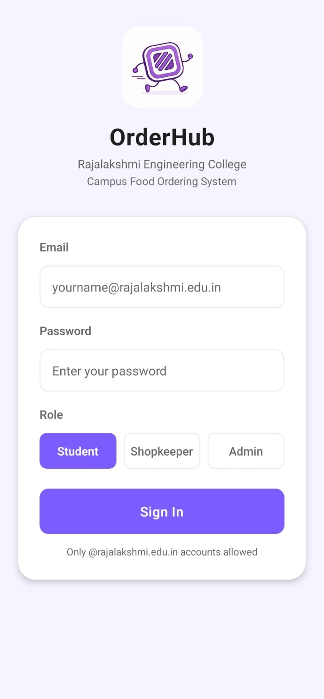
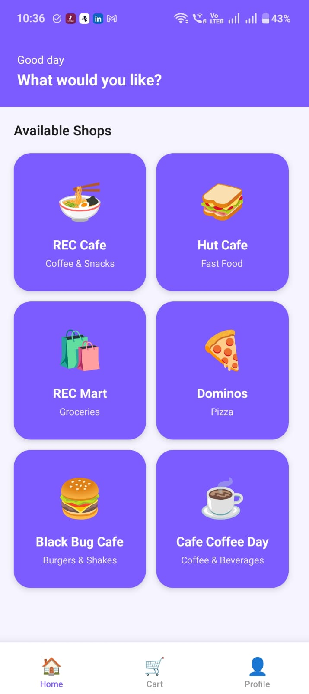
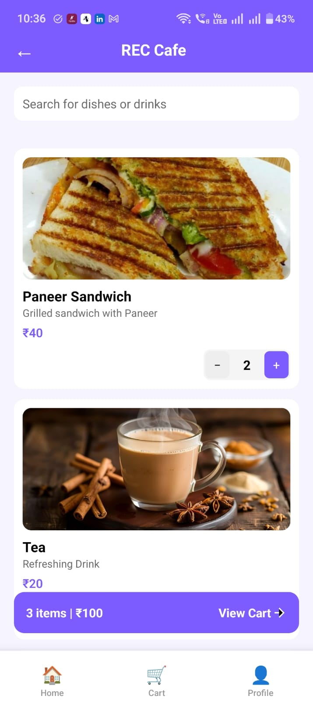
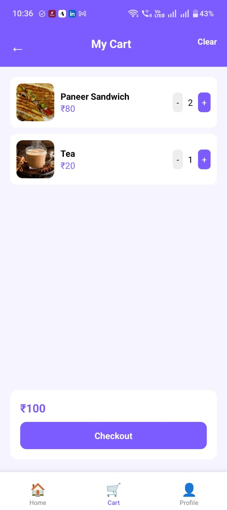
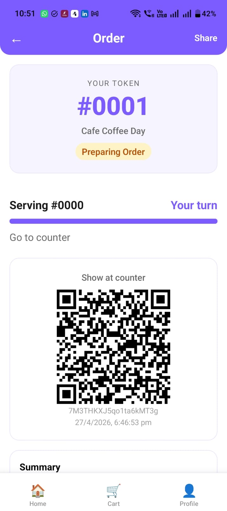
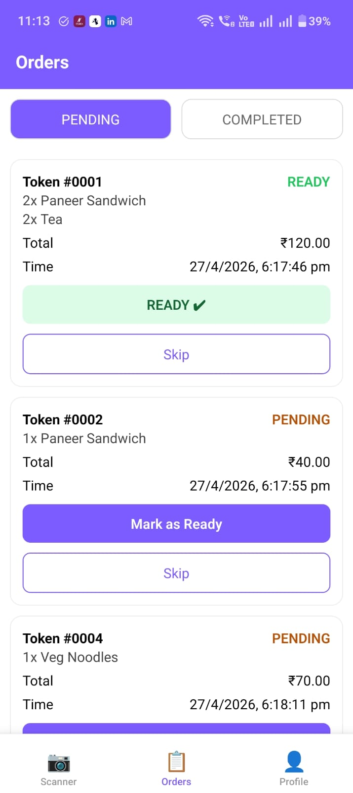
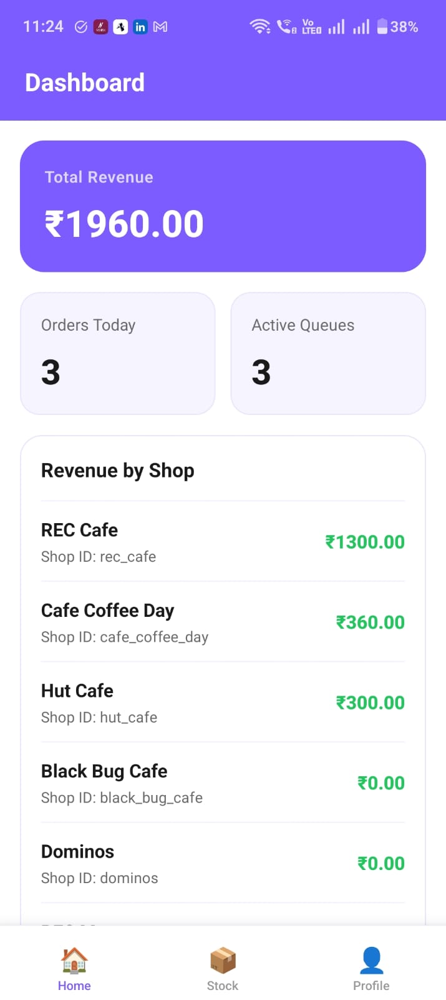

# OrderHub 

A mobile-first campus food ordering and real-time queue management platform built with React Native and Firebase.

> Developed using the Stanford Design Thinking Framework — Empathize → Define → Ideate → Prototype → Test

---

## The Problem

Campus food outlets often rely on a manual workflow where students must walk to a notice board, collect a printed bill, hand it to the shopkeeper, and wait at the counter without knowing when their order will be ready. During short academic breaks, this process leads to long queues, wasted time, and missed meals.

OrderHub digitizes the entire experience by enabling students to place orders remotely, track their position in a live queue, and collect food using a QR-based e-bill.

---

## Screenshots

<div align="center">
  
  
  
  
  <br/><br/>
  
  
  
</div>

---

## Design Thinking Process

### Empathize

Observed students spending a significant portion of their break time waiting in food queues and interacting with a paper-based ordering system.

### Define

Students lacked visibility into order status and estimated waiting time, while food outlets struggled to manage queues efficiently during peak hours.

### Ideate

Designed a mobile-first ordering platform with digital billing, live queue tracking, QR-based order verification, and role-specific management portals.

### Prototype

Built a cross-platform mobile application using React Native and Firebase with dedicated interfaces for students, shopkeepers, and administrators.

### Test

Validated the workflow through iterative testing and refined the ordering, queue tracking, and order collection experience.

---
---

## What It Does

OrderHub provides three dedicated portals on a single platform.

| Role              | Capabilities                                                                                                                                                            |
| ----------------- | ----------------------------------------------------------------------------------------------------------------------------------------------------------------------- |
| **Student**       | Browse menus across multiple campus outlets, place orders remotely, receive QR-based e-bills, track live queue position and estimated wait time, and view order history |
| **Shopkeeper**    | Manage incoming orders, update order status, verify collections through QR scanning, and control queue availability                                                     |
| **Administrator** | Monitor revenue, manage menus and stock, and oversee queue operations across all outlets                                                                                |

---

## Key Features

### Role-Based Access Control

Firebase Authentication combined with Firestore role validation ensures secure access. Users can only access features associated with their assigned role.

### Real-Time Queue Tracking

Firestore listeners provide live updates on queue position, orders ahead, estimated waiting time, and order status.

### QR Code Verification

Each order generates a unique QR code linked to a specific outlet. QR codes become invalid after successful collection, preventing duplicate usage.

### Automatic Stock Management

Inventory is updated immediately when orders are placed. Out-of-stock items are automatically hidden from ordering.

### Digital Queue Management

Shopkeepers can switch between token-based queue mode and walk-in mode depending on crowd levels.

---

## Tech stack


---

## Project Structure

```text
OrderHub/
├── app/
├── assets/
├── components/
├── constants/
├── firebase/
├── hooks/
├── navigation/
├── screens/
├── screenshots/
├── utils/
├── app.json
├── package.json
└── tsconfig.json
```

---

## Installation

```bash
git clone https://github.com/Har-ini01/OrderHub.git
cd OrderHub
npm install
npx expo start
```

Configure Firebase credentials and add the required `google-services.json` file before running the application.

---

## License

This project is intended for educational and portfolio purposes.
